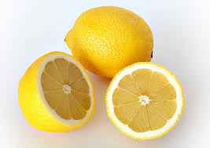

1. Anasiia Zaluzhna, stasia-zal, task 1,2,3
2. Sofia Novomodna, SofiaNovomodna, task 4,5,6

# Lemon

The lemon (Citrus × limon) is a species of small evergreen tree in the Citrus genus of the flowering plant family Rutaceae. A true lemon is a hybrid of the citron and the bitter orange. Its origins are uncertain, but some evidence suggests lemons originated during the 1st millennium BC in what is now northeastern India. Some other citrus fruits are called lemon.

The yellow fruit of the lemon tree is used throughout the world, primarily for its juice. The pulp and rind are used in cooking and baking. The juice of the lemon is about 5–6% citric acid, giving it a sour taste. This makes it a key ingredient in drinks and foods such as lemonade and lemon meringue pie.

In 2022, world production was 22 million tonnes, led by India with 18% of the total.

### Description
The lemon tree produces a pointed oval yellow fruit. Botanically this is a hesperidium, a modified berry with a tough, leathery rind. The rind is divided into an outer colored layer or zest, which is aromatic with essential oils, and an inner layer of white spongy pith. Inside are multiple carpels arranged as radial segments. The seeds develop inside the carpels. The space inside each segment is a locule filled with juice vesicles.[2]

Lemons contain many phytochemicals, including polyphenols, terpenes, and tannins.[3] Their juice contains slightly more citric acid than lime juice (about 47 g/L), nearly twice as much as grapefruit juice, and about five times as much as orange juice.[4]

### Origins
See also: Citrus taxonomy
The lemon, like many other cultivated Citrus species, is a hybrid, in its case of the citron and the bitter orange.[5][6]

The lemon is a hybrid of the citron and the bitter orange.[6]

Taxonomic illustration by Franz Eugen Köhler, 1897
Lemons were most likely first grown in northwest India.[7] The origin of the word lemon may be Middle Eastern.[7] The word draws from the Old French limon, then Italian limone, from the Arabic ليمون laymūn or līmūn, and from the Persian لیمو līmūn, a generic term for citrus fruit, which is a cognate of Sanskrit (nimbū, 'lime').[8]

Lemons entered Europe near southern Italy no later than the second century AD, during the time of Ancient Rome.[7] They were later introduced to Persia and then to Iraq and Egypt around 700 AD.[7] The lemon was first recorded in literature in a 10th-century Arabic treatise on farming; it was used as an ornamental plant in early Islamic gardens.[7] It was distributed widely throughout the Arab world and the Mediterranean region in the Arab Agricultural Revolution between 1000 and 1150.[7] A section on lemon and lime tree cultivation in Andalusia, Spain, was included in Ibn al-'Awwam's 12th-century agricultural work, Kitāb al-Filāha ("Book on Agriculture").[9] The first substantial cultivation of lemons in Europe began in Genoa in the middle of the 15th century. It was introduced to the Americas in 1493, when Christopher Columbus brought lemon seeds to Hispaniola on his voyages. Spanish conquest throughout the New World helped spread lemon seeds, part of the Columbian exchange of plants between the Old and New Worlds. It was mainly used as an ornamental plant and for medicine.[7] In the 19th century, lemons were increasingly planted in Florida and California.[7] In 1747, the English physician James Lind's experiments on seamen suffering from scurvy involved adding lemon juice to their diets, though vitamin C was not yet known as an important dietary ingredient.[7][10]

### Production
Source: FAOSTAT of the United Nations.[17]
In 2022, world production of lemons (combined with limes for reporting) was 22 million tonnes led by India with 18% of the total. Mexico and China were major secondary producers (table).[17]

|**Market**|	**% of Global Production**|	**Total Production (2024/2025, Metric Tons)**|**in 2022, millions of tonnes**|
|------------|------------|--------------|-------|
|Mexico|	34%|	3.5 Million|3.1|
|Turkey|	16%|	1.6 Million|3.8|
|European Union|	15%|	1.52 Million|1.8|
|Argentina|	14%|	1.38 Million|1.3|
